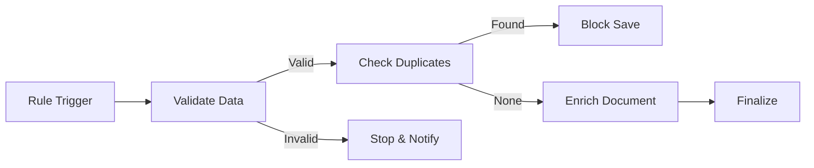

<div align="center">
  

  <h1>FlexiRule</h1>

[](https://github.com/Sendipad/flexirule/actions/workflows/ci.yml?query=branch%3Adevelop)


  <p><strong>Visual Rule Engineer & Orchestration Engine for Frappe apps and ERPNext</strong></p>

</div>

<div align="center">


  <p>
    <em>The Visual Rule Builder is the canonical representation of FlexiRule logic — what you see is exactly what executes.</em>
  </p>
</div>

---

## 🚀 Overview

In modern enterprise systems like **Frappe / ERPNext**, business logic often evolves into a fragmented web of Python hooks scattered across multiple custom apps. This technical debt leads to "hook-hell," where execution order is implicit, debugging is a nightmare, and upgrades are risky.

**FlexiRule** changes the paradigm by providing a **visual, graph-based orchestration layer**. Instead of writing hidden code, you design executable business logic visually — with full control, observability, and safety.

### 💎 Why FlexiRule?

-   **Centralized Logic**: Move rules out of scattered `.py` files into a single, auditable dashboard.
-   **No-Code Configuration**: Custom UI controls (pickers, autocomplete) allow complex logic setup without a single line of code.
-   **Explicit Execution**: Connections define deterministic paths. No more guessing which hook runs first.
-   **Schema-Driven UI**: Configuration forms for custom logic are auto-generated from JSON schemas.

---

## 🖼️ Visual Tour

<details>
<summary><strong>View Detailed Screenshots</strong></summary>

<br/>


<p align="center"><em>Declarative, deeply nested condition trees with deterministic evaluation.</em></p>


<p align="center"><em>Process Operations — schema-driven configuration rendered dynamically at runtime.</em></p>

</details>

---

## 🧠 The Mental Model

FlexiRule is built around three core pillars that bridge the gap between design and execution.

### 1. The Rule (The Entry Point)

A **Rule** defines _when_ logic should trigger. It maps to a DocType and an event (e.g., `Before Save`, `On Submit`). It handles the initial filtering, ensuring logic only runs for the right documents and roles.

### 2. The Rule Action (The Node)

Each node in the graph is a **Rule Action**. It represents a specific step in your business process. Actions accept structured inputs and define the next step in the flow based on their outcome (e.g., `Success` → `Next Step`, `Error` → `Rollback`).

### 3. Process & Operations (The Logic)

A **Process** is a file-backed module (similar to Frappe Reports/Dashboards) that acts as a container for reusable logic.

-   **File-Backed**: Logic is stored in code (`.py`) for performance and version control.
-   **Operations**: Individual functions within a process that declare their own **JSON Schema** for configuration parameters.

---

## ⚡ Execution Flow Example

FlexiRule uses a deterministic graph-based execution engine with built-in cycle detection.



---

## 🛠️ Key Features

-   **Deterministic Graph**: Zero ambiguity in execution order.
-   **Role-Based Security**: Control which rules run for specific user roles.
-   **Monitoring & Logs**: Full execution trace for every rule run, including input/output states and performance stats.
-   **Safety First**: Sandboxed execution context, controlled retries, and centralized exception handling.
-   **Pure Terminology**: Evolved from _UPH → Bolton_ into a clean, standardized, and scalable architecture.

---

## 📦 Installation

```bash
# Get the app
bench get-app flexirule https://github.com/Sendipad/flexirule.git

# Install to your site
bench --site [your-site] install-app flexirule

# Build assets
bench build --app flexirule
```

---

## 🔧 Extensibility

Developers can extend FlexiRule by creating **Standard Processes**:

1. Create a `Process` document and check **Is Standard**.
2. Frappe will generate `.py` and `.js` controllers in your app.
3. Define your logic in Python and your config UI schema in JSON.
4. Your custom logic immediately appears as a selectable operation in the Visual Builder.

---

## 🧩 ERPNext DocType Rule Examples

Below are end-to-end examples showing how a **Rule** (entry point), **Conditions**, and **Actions** can be wired together for common ERPNext DocTypes.

### 1) Sales Invoice — enforce credit limit before submit

**Rule**
- **DocType:** `Sales Invoice`
- **Event:** `Before Submit`
- **Roles:** `Accounts Manager`

**Condition Tree**
- `doc.customer` **is set**
- `doc.outstanding_amount + doc.grand_total` **>** `doc.customer_credit_limit`

**Actions (Graph)**
1. **Fetch Customer Credit Limit** (Process Operation)
   - Inputs: `customer = doc.customer`
   - Output: `customer_credit_limit`
2. **Raise Error**
   - Message: `Customer {{ doc.customer }} exceeds credit limit.`
   - Halt execution.

**Result**
- Sales Invoice cannot be submitted when it pushes the customer above their credit limit.

---

### 2) Purchase Order — auto-assign approver for high value

**Rule**
- **DocType:** `Purchase Order`
- **Event:** `Before Save`
- **Roles:** `Purchase User`

**Condition Tree**
- `doc.grand_total` **>=** `100000`

**Actions (Graph)**
1. **Set Value**
   - Field: `approver`
   - Value: `procurement.head@company.com`
2. **Notify**
   - Channel: Email
   - Message: `High value PO {{ doc.name }} assigned for approval.`

**Result**
- Large POs are routed to the correct approver automatically.

---

### 3) Stock Entry — block negative stock in warehouse

**Rule**
- **DocType:** `Stock Entry`
- **Event:** `Before Submit`
- **Roles:** `Stock Manager`

**Condition Tree**
- `doc.stock_entry_type` **=** `Material Transfer`
- **Any** item row where:
  - `item.qty` **>** `item.actual_qty`

**Actions (Graph)**
1. **Raise Error**
   - Message: `Negative stock not allowed in {{ item.s_warehouse }} for {{ item.item_code }}.`

**Result**
- Prevents stock transfers that would drive a warehouse negative.

---

### 4) Leave Application — auto-approve for small casual leave

**Rule**
- **DocType:** `Leave Application`
- **Event:** `Before Save`
- **Roles:** `HR User`

**Condition Tree**
- `doc.leave_type` **=** `Casual Leave`
- `doc.total_leave_days` **<=** `2`

**Actions (Graph)**
1. **Set Value**
   - Field: `status`
   - Value: `Approved`
2. **Notify**
   - Channel: Email
   - Message: `Leave {{ doc.name }} auto-approved for {{ doc.employee_name }}.`

**Result**
- Short casual leaves can be auto-approved without manual intervention.

---

### 5) Sales Order — ensure delivery date is set for stock items

**Rule**
- **DocType:** `Sales Order`
- **Event:** `Before Save`
- **Roles:** `Sales User`

**Condition Tree**
- **Any** item row where:
  - `item.is_stock_item` **=** `1`
  - `item.delivery_date` **is not set**

**Actions (Graph)**
1. **Raise Error**
   - Message: `Delivery Date is required for stock item {{ item.item_code }}.`

**Result**
- Ensures stock items always have a delivery date before saving.

---

## 🤝 Contributing

<details>
<summary><strong>How to Contribute</strong></summary>

<br/>

**Join the FlexiRule Community!**

FlexiRule is evolving fast. Whether you are a developer, designer, or documenter, your expertise helps shape the future of visual automation in the Frappe ecosystem.

### How You Can Help

-   🐛 **Bug Reports**: Open an issue for any glitches.
-   💡 **Feature Requests**: Suggest new Nodes or Process Operations.
-   📖 **Documentation**: Help us clarify concepts or add examples.
-   🔧 **Pull Requests**: We welcome fixes, optimizations, and new features.

Follow [Frappe Coding Standards](https://frappeframework.com/docs/v14/user/en/guidelines/coding-standards) and ensure all tests pass.

</details>

---

<div align="center">
  <p><strong>FlexiRule</strong> — Declarative, Visual, and Safe Business Logic for Frappe.</p>
  <p>Built with ❤️ by the community.</p>
</div>
